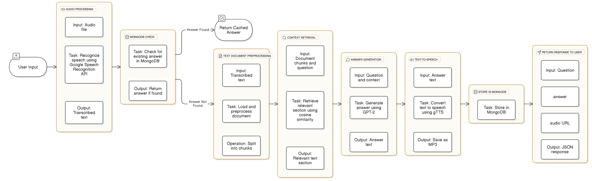

# Task 2: Speech-based Question-Answering System

- Allow users to ask questions via speech input.
- Convert the spoken question to text using the ASR model.
- Search the transcribed audio data for relevant answers.
- Return the most relevant audio segment as the answer.

## Key Features

- Accurate answer retrieval from speech queries.
- Efficient search and indexing of the transcribed corpus.
- User-friendly query and response interface.

## Backend Architecture

<div align="center" style="background:white">
    
</div>

## Backend Functional Components

- **Input Handling**: Audio upload
- **Preprocessing Layer**: Speech recognition, text preprocessing
- **Caching Layer**: MongoDB check and storage
- **Context Retrieval Layer**: Document chunking, similarity check
- **Inference Layer**: Tokenization, embeddings, answer generation
- **Post-Processing Layer**: TTS conversion, audio storage
- **Response Handling**: JSON response generation
- **Utility Components**: Thread pool, static file server

## Backend Folder Structure

```bash
backend/
├── app/ # FastAPI application directory
│   ├── main.py # FastAPI app initialization
│   ├── config.py # Configuration settings
│   ├── models.py # Pydantic models
│   ├── utils.py # Utility functions
│   ├── services.py # Core logic
│   ├── routes.py # API routes
│   └── static/ # Static audio files
│       └── outputs/ # Generated audio files
├── uploads/ # Uploaded audio files
├── .gitignore # Git ignore file
├── preprocessed_data.txt # Transcribed audio data
└── requirements.txt # Python dependencies
```

## Installation

1. Clone the repository and navigate to the project directory.

```bash
git clone https://github.com/Shani-Sinojiya/SandalQuest.git
cd SandalQuest
cd "Task 2"
cd backend
```

2. Install the required dependencies.

```bash
pip install -r requirements.txt
```

3. Start the backend server.

```bash
uvicorn app.main:app --reload
```

## Backend API Endpoints

- **POST** `/predict`: Upload audio file and get the answer.
- **GET** `/static/outputs{filename}`: Download the generated audio file.

## SandalQuest API Tech Stack

### Languages

- **Python**: Core development (API, AI/ML tasks)

### Framework

- **FastAPI**: High-performance, async web framework

### ML & NLP

- **PyTorch**: Deep learning model handling
- **Transformers**: Pre-trained GPT-2 model (Hugging Face)
- **SpeechRecognition**: Speech-to-text conversion
- **gTTS**: Text-to-speech (TTS)

### Database

- **MongoDB**: NoSQL database (via Motor for async operations)

### Storage

- **Local File System**: Store uploads and generated outputs
- **Static Files (FastAPI)**: Serve audio files

### Task Management

- **ThreadPoolExecutor**: Concurrent task execution

### Version Control

- **Git/GitHub**: Source code management

## Frontend

- **React-Native**: Cross-platform application development
- **Expo**: Open-source platform for React Native development

### Installation

1. Navigate to the frontend directory.

```bash
cd frontend
```

2. Install the required dependencies.

```bash
npm install # or pnpx install # or yarn install
```

3. Start the frontend server.

```bash
npm start # or pnpx start # or yarn start
```

### Frontend Tech Stack

#### Languages

- **JavaScript**: Core development (React Native)
- **TypeScript**: Static type-checking

#### Runtimes

- **Node.js**: JavaScript runtime environment

#### Frameworks

- **Expo**: React Native development platform
- **React Native**: Cross-platform application development

### Frontend UI

- Web-based interface for audio upload and speech query

<div align="center">
    
</div>

- Mobile-based interface for audio upload and speech query

<div align="center">
    
</div>
